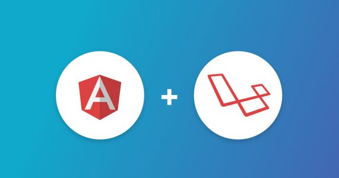

# Laravel back-end and Angular front-end

This is a simple Single Page Application starter for [Laravel 5.7.x](https://laravel.com) +[Angular 7.x.x](https://angular.io/) 

## Required
1. Composer (https://getcomposer.org/)
2. Server local run Apache and MySQL
3. Nodejs >=8 (https://nodejs.org)
4. AngularCLI (https://angular.io)

## Installation

- Clone the repository
- cd laravel(back-end) 
- then run `composer install` and follow Laravel [documentation](https://laravel.com)
- next Create .env file (can be based on .env.example)
- `php artisan key:generate`

## RunServe
- cd laravel(back-end)
- php artisan serve 
- open web browser : url: 127.0.0.1:8000

# FrontEnd

This project was generated with [Angular CLI](https://github.com/angular/angular-cli) version 7.0.5.

## Development server front-end
- cd angular(front-end)
- npm install
- Run `ng serve` for a dev server. Navigate to `http://localhost:4200/`. The app will automatically reload if you change any of the source files.

## Code scaffolding

Run `ng generate component component-name` to generate a new component. You can also use `ng generate directive|pipe|service|class|guard|interface|enum|module`.

## Build

Run `ng build` to build the project. The build artifacts will be stored in the `dist/` directory. Use the `--prod` flag for a production build.

## Running unit tests

Run `ng test` to execute the unit tests via [Karma](https://karma-runner.github.io).

## Running end-to-end tests

Run `ng e2e` to execute the end-to-end tests via [Protractor](http://www.protractortest.org/).

## Further help

To get more help on the Angular CLI use `ng help` or go check out the [Angular CLI README](https://github.com/angular/angular-cli/blob/master/README.md).

## Contact
- Email:mydemoupdate@gmail.com
- Blog: https://dev-update.com
